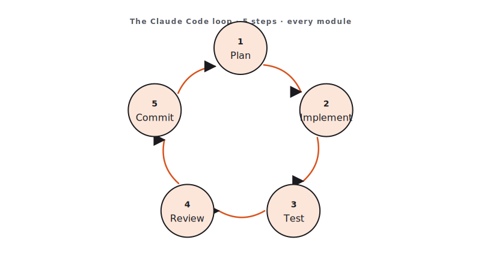

<!-- duration: 20 min -->
<!-- _class: tpl-cover -->
<!-- _paginate: false -->
<!-- _header: "" -->

<span class="module-chip">Module 01 · 20 min</span>

# Setup & AI-First Mindset

Claude Code Bootcamp · Day 1 · Block 1 of 10

Instructor: **Luca Berton** · Endorsed by **Packt Certification**


---

## Your instructor — Luca Berton

- **Automation engineer & educator.** 15+ years shipping infrastructure-as-code, Ansible, and developer-tooling for global enterprises.
- **Author & speaker.** Books on Ansible and DevOps; regular conference speaker; runs a YouTube channel on automation.
- **AI-paired delivery practitioner.** Uses Claude Code daily to plan, refactor, document, and review production code.
- **Today's mission:** get you shipping with Claude Code the same way — safely, repeatably, with a loop you can take home.

🔗 [lucaberton.com](https://lucaberton.com/)

---

<!-- _class: tpl-show -->

## Claude Code is everywhere (May 2026)

Claude Code is no longer just a CLI — it ships on **four surfaces** with one shared context:

- **Terminal** — hands-on repo work, scripts, `claude -p` piping.
- **VS Code / JetBrains** — inline diffs, editor-native review, gutter actions.
- **Desktop app** — side-by-side sessions, visual diff review, screenshots.
- **Web** — remote/cloud tasks, parallel work, share a session with a teammate.

Today we work mostly in **terminal + IDE**. The patterns transfer to the other surfaces unchanged.

---

<!-- _class: tpl-objectives -->

## Promise

By the end of this 20-minute block you will:

1. Have verified your pre-work environment (Claude Code, Python 3.11+, Node.js 20+, Git).
2. Know exactly how the next 4 hours of instruction are structured.
3. Be able to name the five steps of the **AI coding loop** we will reuse in every module.

---

## Why this matters

- We are building **10 small projects in 4 hours**. That is impossible by hand. It is achievable when you treat Claude Code as a junior engineer that you direct, review, and merge.
- The cost of "spray-and-pray" prompting compounds: bad prompt → bad code → bad tests → wasted module. A repeatable loop keeps you above the line.
- Production teams using AI-paired coding report 30–50% throughput gains *only when* they use a loop. Everyone else regresses on quality.

---

## Concepts

- **AI-paired coding**: you stay the engineer of record. Claude proposes; you decide.
- **The loop**: **Plan → Implement → Test → Review → Commit.** Every module repeats this.
- **The skill library**: reusable instructions to Claude that survive across projects (`skills/`).
- **Definition of Done**: a hard checklist per module; if it isn't checked, the module isn't shipped.
- **Submission as proof of work**: every module produces a folder in your final zip.



---

<!-- _class: tpl-show -->

## Slash commands cheat sheet

The most-used Claude Code slash commands. Type them at the prompt.

| Command | What it does |
|---|---|
| `/help` | List every available slash command |
| `/init` | Scaffold a `CLAUDE.md` for the current repo |
| `/clear` | Reset the conversation (forget context) |
| `/compact` | Compress history to save tokens (keeps summary) |
| `/model` | Switch model mid-session (e.g., Sonnet ↔ Opus) |
| `/cost` | Show token spend and session cost |
| `/review` | Review the working-tree diff |
| `/agents` · `/mcp` · `/hooks` | Manage subagents, MCP servers, hooks |
| `/memory` | Open the memory editor (persistent notes) |
| `/permissions` | Allow / deny tools per project |
| `/doctor` | Diagnose env, auth, and integration issues |
| `/exit` | Leave the session (Ctrl-D works too) |

Forgot one? `/help` is always one keystroke away.

---

<!-- _class: tpl-show -->

## Live demo flow

1. Instructor opens this repo in their IDE with Claude Code attached.
2. Runs `git status` — clean. Runs `python3 --version` and `node --version` — both green.
3. Asks Claude: *"List the top-level files and tell me what kind of repository this is."*
4. Class watches Claude read the repo and respond with the answer everyone produced in pre-work.
5. Instructor narrates the 5-step loop while Claude is responding.

---

<!-- _class: tpl-show -->

## Mini project

**Verify your AI Coding Workspace.**

Deliverable for module 1 in your submission zip: `module-01/` containing

- `environment.txt` — output of `python3 --version`, `node --version`, `git --version`
- `loop-notes.md` — your one-paragraph explanation of the 5-step loop, written in your own words

---

<!-- _class: tpl-try -->

## Step-by-step lab

1. Open a terminal. Run the three `--version` commands; pipe to `module-01/environment.txt`.
2. In Claude Code, paste the prompt below.
3. Read Claude's reply. Edit it into your own one-paragraph explanation.
4. Save it to `module-01/loop-notes.md`.
5. Tick the Definition of Done.

---

<!-- _class: tpl-show -->

## Suggested Claude Code prompts

```text
You are onboarding a new engineer who has never used AI-paired coding.
In one short paragraph (max 6 sentences), explain the loop:
Plan → Implement → Test → Review → Commit.
Use the metaphor of directing a junior engineer.
End with one sentence about why skipping the Review step is the most common failure mode.
```

---

<!-- _class: tpl-done -->

## Deliverable checklist

- [ ] `module-01/environment.txt` contains three valid version strings.
- [ ] `module-01/loop-notes.md` exists and is non-empty.
- [ ] The notes name all five steps of the loop in order.
- [ ] The notes are in **your own words**, not Claude's verbatim output.

---

<!-- _class: tpl-done -->

## Definition of done

✅ Environment verified · ✅ Loop explained in your own words · ✅ Submission folder `module-01/` exists with both files.

---

<!-- _class: tpl-try -->

## Review checkpoint

Pair with the person next to you. In 60 seconds each:

- Read each other's `loop-notes.md`.
- Identify one sentence you would tighten.
- Confirm both `environment.txt` files show identical major versions.

---

## Common mistakes

- Copying Claude's reply verbatim — instructor scoring penalises this.
- Treating "Review" as optional. Skipping review is how AI-generated bugs reach production.
- Using PowerShell on Windows. Move to WSL2 (see `student-guide.md`).
- Pre-work skipped — you cannot keep up; pair with a neighbor for module 1 only.

---

## Instructor notes

- Keep this block to 20 min hard. Mindset only — **no live installs**.
- Open with Claude Code on a known repo, not a slide.
- If a student's environment is broken, mark them as paired and continue.
- Reference the schedule table in `README.md`. Set expectations on break placement.

---

<!-- _class: tpl-next -->

## Transition to next module

Now that the loop is named, we apply step 1 — **Plan** — by writing prompts the way a Tech Lead writes specs.
**Next: Module 2 — Prompting Like a Tech Lead.**

<!-- polish-log
(intermediate-content-polish feature 004) — populated during US2 polish pass.
-->
