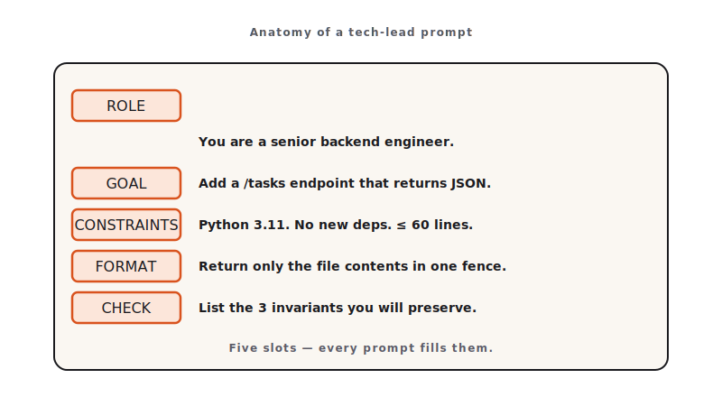

<!-- duration: 24 min -->
<!-- _class: tpl-cover -->
<!-- _paginate: false -->
<!-- _header: "" -->

<span class="module-chip">Module 02 · 24 min</span>

# Prompting Like a Tech Lead

Claude Code Bootcamp · Day 1 · Block 2 of 10


---

<!-- _class: tpl-objectives -->

## Promise

In 24 minutes you will:

1. Write a Tech-Lead-grade prompt using the **GCOE pattern** (Goal, Constraints, Output, Examples).
2. Ship a working **CLI Task Manager** — add, list, complete, delete — to disk.
3. Iterate the prompt by deleting one constraint and observing the diff.

---

## Why this matters

- A vague prompt produces vague code. The bottleneck for AI-paired coding is **prompt quality**, not model quality.
- A Tech Lead does not say *"build a CLI"*. They write a one-page spec. We are going to write that spec in 90 seconds and let Claude implement it.
- Every later module reuses GCOE. Get this right and the day gets faster.

---

## Concepts

- **GCOE**: Goal · Constraints · Output format · Examples. Skip any one and quality drops.
- **Goal**: what the user can do at the end. Verb-led, single sentence.
- **Constraints**: language, dependencies, file layout, error handling, what must *not* be done.
- **Output format**: file paths, exit codes, JSON schema if applicable.
- **Examples**: one happy path + one edge case = enough.



---

<!-- _class: tpl-show -->

## Live demo flow

1. Instructor pastes a deliberately vague prompt: *"Make a CLI to manage tasks."*
2. Class observes Claude's reasonable but generic output.
3. Instructor rewrites in GCOE form. Re-runs.
4. Class observes the lift: real CLI, real persistence, real tests scaffolded.
5. Instructor **deletes one constraint** mid-demo (e.g., "no third-party deps") and re-runs to show the regression.

---

<!-- _class: tpl-show -->

## Mini project

**CLI Task Manager.**

- `task add "<text>"` → appends a task with id, status, timestamp.
- `task list [--status open|done]` → tabular output to stdout.
- `task done <id>` → flips status.
- `task delete <id>` → removes the row.
- Persisted to `tasks.json` in the working directory.

---

<!-- _class: tpl-try -->

## Step-by-step lab

1. Pick your track: **Python** (`argparse`, stdlib only) or **Node.js + TypeScript** (`commander` + `tsx`).
2. Create `module-02/` in your working directory.
3. Open Claude Code, paste the GCOE prompt below (verbatim, then edit the *Goal* line if you want a twist).
4. Save the generated files into `module-02/`.
5. Manually run all four commands; verify `tasks.json` updates.
6. Iterate: delete the *"no third-party deps"* line in your prompt, re-generate, diff. Note the change in `module-02/iteration-notes.md`.

---

<!-- _class: tpl-show -->

## Suggested Claude Code prompts

```text
GOAL
Build a single-binary CLI Task Manager so a developer can manage TODOs from the terminal.

CONSTRAINTS
- Language: Python 3.11 (stdlib only) — OR — TypeScript on Node.js 20 with `commander` + `tsx`.
- Persistence: a single JSON file `tasks.json` in CWD.
- No background processes. No network calls.
- Exit code 0 on success, 1 on user error, 2 on internal error.
- All user-facing strings in English.

OUTPUT FORMAT
- One source file (Python) or `src/index.ts` + `package.json` (Node).
- A short README explaining install + the four commands.

EXAMPLES
- `task add "Write the spec"` → "Added task #1: Write the spec"
- `task list` → tabular: id, status, created_at, text
- `task done 1` → "Marked #1 as done"
- `task delete 99` → exit 1, "No task with id 99"
```

---

<!-- _class: tpl-done -->

## Deliverable checklist

- [ ] `module-02/` contains source + README.
- [ ] All four commands work end-to-end with `tasks.json`.
- [ ] `module-02/iteration-notes.md` documents one prompt edit and the resulting code diff.
- [ ] Reference solution **not** consulted before completing the lab.

---

<!-- _class: tpl-done -->

## Definition of done

✅ Four commands all return correct exit codes · ✅ `tasks.json` round-trips state across runs · ✅ Iteration note explains *why* the deleted constraint mattered.

---

<!-- _class: tpl-try -->

## Review checkpoint

In pairs (60 s each):

1. Run each other's `task add` and `task list`.
2. Identify one missing edge case (empty title? duplicate id? corrupt JSON?).
3. Decide whether you would add it as a new constraint or accept the gap.

---

## Common mistakes

- Asking Claude for "a CLI" with no constraints — output looks fine, fails review.
- Allowing third-party deps you didn't intend to install. The constraint exists for a reason.
- Skipping examples. The model uses examples to disambiguate; without them it guesses.
- Forgetting exit codes. Production CLIs are graded on exit codes, not stdout.

---

## Instructor notes

- 6 / 4 / 12 / 2 split: concept · demo · lab · checkpoint.
- The "delete one constraint and re-run" moment is the highlight. Don't skip it.
- For mixed-language rooms: write the GCOE prompt in language-agnostic terms, only specify language in CONSTRAINTS.
- If short on time, drop the iteration notes (still ship the CLI).

---

<!-- _class: tpl-next -->

## Transition to next module

The prompt worked because it carried context: language, layout, exit codes. We now persist that context to a file so Claude remembers it across every prompt for the rest of the day.
**Next: Module 3 — Project Context with `CLAUDE.md`.**

<!-- polish-log
(intermediate-content-polish feature 004) — populated during US2 polish pass.
-->
