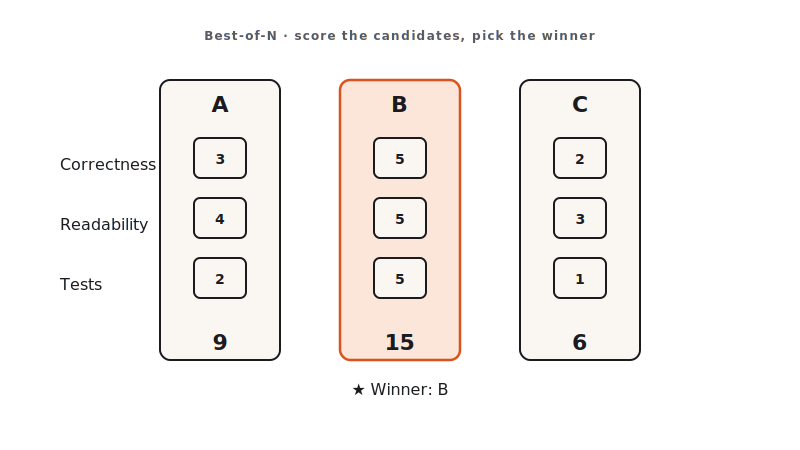

<!-- duration: 30 min -->
<!-- _class: tpl-cover -->
<!-- _paginate: false -->
<!-- _header: "" -->

<span class="module-chip">Module 04 · 30 min</span>

# Build Faster with Best-of-N

Claude Code Bootcamp · Day 1 · Block 4 of 10


---

<!-- _class: tpl-objectives -->

## Promise

In 30 minutes you will:

1. Generate **3 independent candidate implementations** of the same API.
2. Score each on the 3-criterion rubric: **correctness, simplicity, fit**.
3. Commit the winner. Throw the rest away — and feel good about it.

---

## Why this matters

- The first thing a model produces is rarely the best thing it can produce. Variance is real and exploitable.
- Best-of-N converts a 60-second wait into a measurably better artifact, *if you have a rubric*. Without a rubric you are guessing.
- This is how senior engineers operate: propose multiple solutions, justify the pick.

---

## Concepts

- **Best-of-N (BoN)**: produce N candidates, score, pick. N=3 is the sweet spot today.
- **Three-criterion rubric**:
  - *Correctness*: does it pass the manual test plan?
  - *Simplicity*: would a junior engineer maintain this on day one?
  - *Fit*: does it match `CLAUDE.md` conventions and the existing repo style?
- **Independent candidates**: each candidate gets its own prompt context. No "now improve it"; that is iteration, not BoN.



---

<!-- _class: tpl-show -->

## Live demo flow

1. Instructor authors the prompt for a Notes API.
2. Generates **candidate A** in chat 1, saves to `candidate-a/`.
3. New chat: **candidate B**. Same prompt. Saves to `candidate-b/`.
4. Same again for **candidate C**.
5. Side-by-side scoring on the rubric. Winner committed; losers shown to class to highlight the lift.

---

<!-- _class: tpl-show -->

## Mini project

**Notes API.**

- `POST /notes` — create note `{title, body}`; returns id + timestamps.
- `GET /notes` — list with optional `?q=` substring search.
- `GET /notes/:id` — fetch one or 404.
- `PATCH /notes/:id` — update title and/or body.
- `DELETE /notes/:id` — 204.
- Persisted in **SQLite** (`notes.db`).

---

<!-- _class: tpl-try -->

## Step-by-step lab

1. Pick your track: **Python** (FastAPI + Pydantic v2 + sqlite3) or **Node** (Hono + Zod + better-sqlite3).
2. Create `module-04/` and three sibling folders: `candidate-a/`, `candidate-b/`, `candidate-c/`.
3. Open three separate Claude Code chats. Paste the same prompt into each.
4. Save each candidate into its folder.
5. Score each candidate on the rubric below; record in `module-04/scoring.md`.
6. Copy the winner's files into `module-04/winner/` and commit.

---

<!-- _class: tpl-show -->

## Suggested Claude Code prompts

```text
GOAL
Build a small Notes API persisting to SQLite.

CONSTRAINTS
- Track A: Python 3.11 with FastAPI + Pydantic v2 + the sqlite3 stdlib module.
- Track B: TypeScript on Node 20 with Hono + Zod + better-sqlite3.
- One process. No migrations framework — initialise the schema at startup.
- HTTP status codes: 201 on create, 200 on read/update, 204 on delete, 404 on missing, 422 on invalid body.
- Timestamps in ISO 8601 UTC.

OUTPUT FORMAT
- A runnable project (single source file is fine) plus a 5-line README with the run command.

EXAMPLES
- POST /notes {"title":"a","body":"b"} → 201 {"id":1,"title":"a","body":"b","created_at":"2026-05-30T13:00:00Z","updated_at":"2026-05-30T13:00:00Z"}
- GET /notes?q=spec → 200 [matching notes]
- GET /notes/999 → 404 {"error":"not found"}
```

```text
SCORING TEMPLATE — fill once per candidate
Candidate: [a|b|c]
Correctness (0–3): can I exercise all five endpoints with curl?
Simplicity   (0–3): is the source single-glance readable?
Fit          (0–3): does it follow CLAUDE.md conventions?
Total: __ / 9
Notes:
```

---

<!-- _class: tpl-done -->

## Deliverable checklist

- [ ] All three candidates exist in `module-04/candidate-{a,b,c}/`.
- [ ] `module-04/scoring.md` has scores and one-paragraph justification per candidate.
- [ ] `module-04/winner/` is a clean copy of the chosen candidate.
- [ ] You can run the winner: `curl` against all five endpoints succeeds.

---

<!-- _class: tpl-done -->

## Definition of done

✅ Three candidates generated independently · ✅ Rubric applied honestly · ✅ Winner runs end-to-end · ✅ Losers archived, not deleted.

---

<!-- _class: tpl-try -->

## Review checkpoint

Pair (60 s each):

1. Read the partner's `scoring.md`.
2. Challenge one score. Was the criterion actually applied, or did it shade towards "I like this one"?
3. Confirm the partner's winner runs.

---

## Common mistakes

- Generating one candidate, then asking "now make it better" three times. That is iteration, not BoN.
- Skipping the rubric. Without it, you pick by vibe; the lift disappears.
- Picking a winner that fails the manual test plan because it is "more elegant". Correctness gates everything else.
- Throwing the losers away before scoring is recorded.

---

## Instructor notes

- 6 / 6 / 15 / 3 split.
- Open `skills/best-of-n/SKILL.md` live to anchor the rubric.
- If running short, drop N to 2.
- Have the manual `curl` script ready as the reference test plan.

---

<!-- _class: tpl-next -->

## Transition to next module

We have a winner. But "looks right" is not "is right". Next we write tests, plant a bug, and make Claude debug its own code.
**Next: Module 5 — Testing, Debugging & Self-Review.**

<!-- polish-log
(intermediate-content-polish feature 004) — populated during US2 polish pass.
-->
