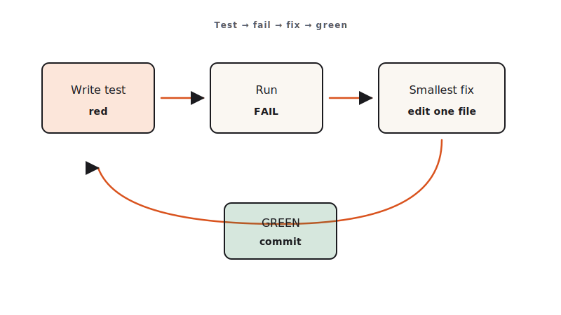

<!-- duration: 28 min -->
<!-- _class: tpl-cover -->
<!-- _paginate: false -->
<!-- _header: "" -->

<span class="module-chip">Module 05 · 28 min</span>

# Testing, Debugging & Self-Review

Claude Code Bootcamp · Day 1 · Block 5 of 10


---

<!-- _class: tpl-objectives -->

## Promise

In 28 minutes you will:

1. Generate a real **pytest** (or **vitest**) suite against your module-4 Notes API.
2. Find and fix **two seeded bugs** using Claude's self-review.
3. Author your own **Code Review Rubric** at `exercises/part-05/code-review-rubric.md`.

---

## Why this matters

- AI generates plausible code. Plausible ≠ correct. Tests are the only durable contract.
- Self-review by Claude catches a surprising fraction of its own mistakes — *if you ask correctly*.
- Your **Code Review Rubric** becomes the discriminator for "done" for the rest of the day. It outlasts the workshop.

---

## Concepts

- **Test pyramid for AI code**: lots of cheap unit tests + a few integration tests covering the happy path + error paths.
- **Self-review prompt**: ask Claude to enumerate bugs *as if* it were reviewing a stranger's PR. The framing matters.
- **Off-by-one and boundary bugs**: Claude's blind spot. Always test boundaries.
- **Your rubric ≠ instructor rubric**. The student deliverable here is `code-review-rubric.md`. The instructor's grading rubric lives at `assessments/rubric.md`. Two distinct artifacts.



---

<!-- _class: tpl-show -->

## Bundled skills do the heavy lifting

Claude Code ships bundled skills you can invoke directly. Use them instead of rewriting prompts.

- `/debug` — reproduce, isolate, propose a minimal fix with a regression test.
- `/verify` — re-run the failing case after the fix and prove it green.
- `/code-review` — structured review against rubric (security, tests, naming, edge cases).
- `/loop` — iterate test → fix → test until green or a hard stop.
- `/batch` — apply the same fix shape across many files.

**Rule of thumb:** if you find yourself typing the same prompt twice, reach for a bundled skill or author your own (Module 9).

---

<!-- _class: tpl-show -->

## Live demo flow

1. Instructor opens the module-4 winner.
2. Asks Claude to generate a test suite (Python: pytest + httpx; Node: vitest + supertest-like fetch).
3. Runs tests — green.
4. Plants **one** off-by-one bug live (e.g., pagination boundary).
5. Self-review prompt → Claude finds the bug.
6. Class repeats with a second seeded bug from `BUGS.md` in the reference solution.

---

<!-- _class: tpl-show -->

## Mini project

Three deliverables under `module-05/`:

1. `tests/` — full suite for the module-4 API.
2. `bug-fix-notes.md` — for each of two bugs: symptom, suspected cause, Claude's diagnosis, your fix.
3. `code-review-rubric.md` — your personal rubric for reviewing AI code.

---

<!-- _class: tpl-try -->

## Step-by-step lab

1. `cd` into your module-4 winner folder.
2. Run the prompt for the test suite. Save under `tests/`.
3. Run the suite. Fix any genuine failures.
4. Open `BUGS.md` from the reference solution (instructor will publish it) and inject the two seeded bugs into your code.
5. Run tests — they should fail.
6. Use the self-review prompt to fix each. Document in `bug-fix-notes.md`.
7. Author `code-review-rubric.md` (≤ 1 page, 5–8 checks).
8. Copy all three deliverables into `module-05/` for submission.

---

<!-- _class: tpl-show -->

## Suggested Claude Code prompts

```text
GENERATE TESTS
Read the Notes API in this folder. Write a pytest suite (or vitest if Node)
covering: create, list, search, get-one, update, delete, 404, 422.
Use httpx (or fetch) and a temp SQLite DB per test. No network. No mocks
of HTTP — start the app in-process.
```

```text
SELF-REVIEW
You are reviewing a stranger's PR. The diff is below.
Enumerate every potential bug (off-by-one, null handling, race, error path,
type coercion). Rank by severity. Propose the smallest possible fix per item.
Do not write code yet — just the list.
```

```text
RUBRIC
Draft a one-page code review rubric for AI-generated code.
5–8 checks. Each check is a yes/no question that takes ≤ 30 seconds to answer.
Optimize for catching the kinds of bugs Claude tends to miss
(boundaries, error paths, hidden assumptions about types).
```

---

<!-- _class: tpl-done -->

## Deliverable checklist

- [ ] `module-05/tests/` exists; full suite runs green on the fixed code.
- [ ] `module-05/bug-fix-notes.md` documents two bugs end-to-end.
- [ ] `module-05/code-review-rubric.md` is one page or less and is a checklist, not prose.
- [ ] You can name one rubric item that is *not* in `skills/code-review/SKILL.md` — it is **yours**.

---

<!-- _class: tpl-done -->

## Definition of done

✅ Test suite green · ✅ Two bugs found and fixed with notes · ✅ Personal rubric authored and committed.

---

<!-- _class: tpl-try -->

## Review checkpoint

Pair (60 s each):

1. Run the partner's tests against your module-4 winner. Green or red?
2. Read each other's `code-review-rubric.md`. Pick one item to *steal* and one to challenge.

---

## Common mistakes

- Letting Claude generate tests that mock the SUT itself — useless.
- Self-review without the "stranger's PR" framing — you get sycophantic output.
- Copying the skill rubric verbatim. Your rubric must reflect *your* blind spots.
- Mixing up the student rubric with the instructor's grading rubric. They are different files.

---

## Instructor notes

- 6 / 6 / 13 / 3 split.
- Plant the off-by-one live; the *aha* lands hardest in real time.
- Have `BUGS.md` from the reference solution ready to publish at lab start.
- Reinforce the two-rubrics distinction every time it comes up.

---

<!-- _class: tpl-next -->

## Transition to next module

We have a tested, debugged, reviewed module. Now we ship it through Git the way a senior engineer would — branch, commit message, PR description.
**Next: Module 6 — Git Workflows for Safe AI Dev.**

<!-- polish-log
(intermediate-content-polish feature 004) — populated during US2 polish pass.
-->
