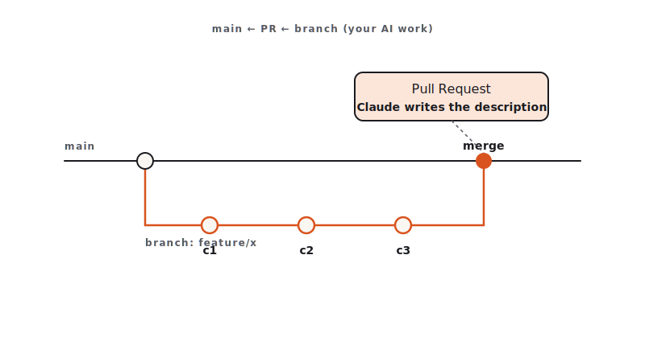

<!-- duration: 22 min -->
<!-- _class: tpl-cover -->
<!-- _paginate: false -->
<!-- _header: "" -->

<span class="module-chip">Module 06 · 22 min</span>

# Git Workflows for Safe AI Dev

Claude Code Bootcamp · Day 1 · Block 6 of 10


---

<!-- _class: tpl-objectives -->

## Promise

In 22 minutes you will:

1. Move your module-4/5 work onto a feature branch with a meaningful name.
2. Stage atomic commits whose messages **Claude** wrote from the diff.
3. Generate a **PR description** that a senior engineer would actually merge.

---

## Why this matters

- AI accelerates code production. Without disciplined Git, that acceleration becomes "20 commits called 'wip' on `main`".
- A clean branch + commit + PR is the artefact that survives. The chat transcript does not.
- Reviewers trust diffs they can read. Claude is excellent at turning diffs into prose.

---

## Concepts

- **Branch naming**: `<type>/<scope>-<short-summary>` — e.g., `feat/notes-api-search`.
- **Atomic commits**: each commit changes one logical thing. Claude can split your working tree if you ask.
- **Conventional Commits**: `feat:`, `fix:`, `chore:`, `docs:`, `test:`. The skill `skills/git-workflow/SKILL.md` holds the full set.
- **PR description shape**: What changed · Why · How to test · Risk · Rollback.



---

<!-- _class: tpl-show -->

## `@claude` in GitHub Actions

The official **anthropics/claude-code-action** turns Claude Code into a teammate inside your repo:

- **`@claude` mentions** on issues and PRs — answer questions, propose patches, push a fix branch.
- **Automated PR review** — structured comments, security flags, suggested diffs.
- **Issue-to-PR flow** — Claude reads the ticket, opens a branch, lands a draft PR.
- **Scheduled maintenance** — release notes, changelog updates, dependency triage.
- **Self-hosted runners** — keep code on your infrastructure; same action.

Think of CI Claude as the **first reviewer** on every PR — you still merge.

---

<!-- _class: tpl-show -->

## Live demo flow

1. Instructor on the module-5 working tree, dirty.
2. `git switch -c feat/notes-api-tests-and-fixes`.
3. Asks Claude: *"Group the staged changes into atomic commits and propose messages."*
4. Applies, commits.
5. Asks Claude: *"Write the PR description from the branch diff."* Reviews, edits, opens a draft PR (or simulates).

---

<!-- _class: tpl-show -->

## Mini project

Take your module-5 work and ship it as a branch + commits + PR text.

Deliverables under `module-06/`:

- `branch.txt` — the branch name + final `git log --oneline` output
- `commits.md` — the commit messages Claude proposed and which ones you accepted/edited
- `pr.md` — the final PR description

---

<!-- _class: tpl-try -->

## Step-by-step lab

1. In your module-5 repo, `git switch -c feat/<your-scope>`.
2. Stage everything: `git add -A`.
3. Run the **commit-splitter** prompt. Apply Claude's groupings (you may override).
4. Run the **PR-description** prompt against the branch diff.
5. Review and edit. The PR text must mention test results and rollback.
6. Save the three artefacts to `module-06/`.

---

<!-- _class: tpl-show -->

## Suggested Claude Code prompts

```text
COMMIT SPLITTER
Here is the working-tree diff (output of `git diff --staged`).
Propose 3–6 atomic commits. For each: a Conventional Commit subject line
(<= 72 chars) and a body explaining why (not what — the diff shows what).
Then list which paths/hunks belong to which commit so I can split.
```

```text
PR DESCRIPTION
Generate a pull request description from the branch diff below.
Sections, in order:
- Summary (2 sentences)
- Why
- What changed (bullets, grouped by area)
- How to test (exact commands)
- Risk
- Rollback
End with a "Reviewer checklist" of 3–5 yes/no items.
Keep the whole thing under 40 lines.
```

---

<!-- _class: tpl-done -->

## Deliverable checklist

- [ ] Feature branch exists and contains all module-5 work.
- [ ] `commits.md` shows at least 3 atomic commits with Conventional Commit subjects.
- [ ] `pr.md` has all six required sections.
- [ ] You opened a real PR or simulated one (screenshot acceptable).

---

<!-- _class: tpl-done -->

## Definition of done

✅ Branch named correctly · ✅ Atomic commits with sensible messages · ✅ PR description is mergeable as-is.

---

<!-- _class: tpl-try -->

## Review checkpoint

Pair (60 s each):

1. Read partner's `pr.md`. Would you merge it cold? If not, why not?
2. Check the commit log: any "wip" or "fix"? Coach.

---

## Common mistakes

- One giant commit called `feat: stuff`. Re-run the splitter.
- PR description that says *what* but not *why* — reviewers reject these.
- Letting Claude write the description from the prompt instead of from the diff. Always paste the diff.
- Pushing to `main`. Branch first, always.

---

## Instructor notes

- 5 / 4 / 11 / 2 split.
- The branch metaphor: "your AI work needs containment". Repeat it.
- If short, drop the branch-name discussion; keep splitter and PR.
- Use `skills/git-workflow/SKILL.md` as the canonical reference; cite it.

---

<!-- _class: tpl-next -->

## Transition to next module

Code, tests, branch, PR — all from text prompts. Next we widen the input modality: from **a screenshot to a working UI** in one pass.
**Next: Module 7 — Multimodal: Screenshot to UI.**

<!-- polish-log
(intermediate-content-polish feature 004) — populated during US2 polish pass.
-->
