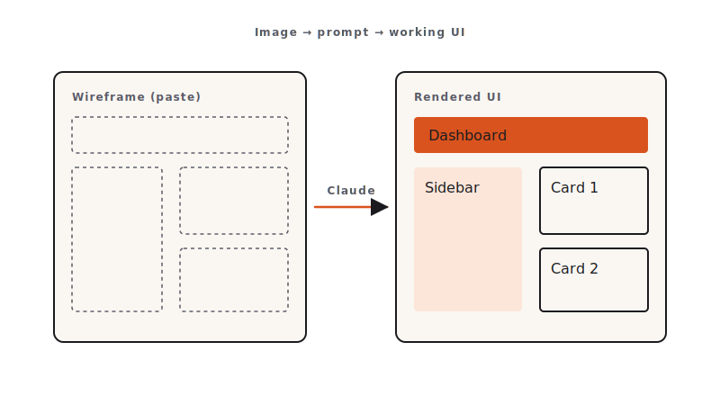

<!-- duration: 30 min -->
<!-- _class: tpl-cover -->
<!-- _paginate: false -->
<!-- _header: "" -->

<span class="module-chip">Module 07 · 30 min</span>

# Multimodal: Screenshot to UI

Claude Code Bootcamp · Day 1 · Block 7 of 10


---

<!-- _class: tpl-objectives -->

## Promise

In 30 minutes you will:

1. Hand Claude a **wireframe image** as input.
2. Generate a single-page **Dashboard UI** matching the layout.
3. Compare your render to the wireframe side-by-side and iterate one round.

---

## Why this matters

- Most product work starts as a sketch. Until now, you had to translate the sketch to text prompts. That step *was* the bottleneck.
- Multimodal Claude reads the image directly. The translation cost goes to zero.
- This is also where AI confidently invents details. Visual diffing keeps it honest.

---

## Concepts

- **Two wireframe sources** ship with the exercise: `wireframe.png` (canonical, generated from `wireframe.mmd` Mermaid source) and `wireframe-sketch.png` (rough-hand variant from `wireframe-sketch.svg`).
- **Layout-first prompting**: describe what you cannot see in the image — interactivity, data source, framework — and let Claude read the layout.
- **Visual diff loop**: render → screenshot → ask Claude to diff → patch.
- **Scope discipline**: ship the layout. Theming and animations are stretch.



---

<!-- _class: tpl-show -->

## Live demo flow

1. Instructor opens `exercises/part-07/wireframe-sketch.png` in Claude Code.
2. Pastes the prompt with the framework constraint (Python: Flask + Jinja or Streamlit).
3. Saves output, runs locally on `localhost:5000` or similar.
4. Takes a screenshot, attaches it next to the wireframe, asks Claude: *"What's missing or wrong?"*
5. Applies one round of fixes. Demo ends with a side-by-side comparison projected.

---

<!-- _class: tpl-show -->

## Mini project

**Dashboard UI** matching `exercises/part-07/wireframe.png`:

- Header bar with title + a primary action button.
- Left sidebar with 3–5 nav links.
- Main area: 3 KPI cards across the top, then a table of 5 sample rows.
- Footer with a small "version" string.
- Static data is fine. Hardcode it.

---

<!-- _class: tpl-try -->

## Step-by-step lab

1. Open `exercises/part-07/`. Read `README.md` end to end.
2. Decide which wireframe to use: `wireframe.png` (canonical) or `wireframe-sketch.png` (rough sketch — extra challenge).
3. Run the multimodal prompt with the chosen image attached.
4. Save the generated app to `module-07/`.
5. Run it locally. Take a screenshot at 1280×720. Save as `module-07/render.png`.
6. **Visual-diff loop**: paste both images into Claude. Ask for the gap list. Apply at most three fixes.
7. Re-screenshot as `module-07/render-final.png`.

---

<!-- _class: tpl-show -->

## Suggested Claude Code prompts

```text
INITIAL GENERATION
Below is a wireframe image. Build a working single-page web app matching the layout.

Constraints:
- Python 3.11. Track A: Flask + Jinja templates. Track B: Streamlit. Pick one and state the choice in the README.
- Static hardcoded sample data. No database. No auth.
- Single command to run: `python app.py` (Flask) or `streamlit run app.py`.
- Plain CSS, no Tailwind, no component libraries.
- Render at 1280x720 should look unmistakably like the wireframe.
```

```text
VISUAL DIFF
Image 1: the wireframe.
Image 2: my current render.

List the gaps in priority order. For each gap:
- One-sentence description.
- Smallest patch that closes it.

Stop after 5 items.
```

---

<!-- _class: tpl-done -->

## Deliverable checklist

- [ ] `module-07/` contains a runnable app.
- [ ] `module-07/render-final.png` exists at 1280×720.
- [ ] Header, sidebar, 3 KPI cards, table of 5 rows, footer all present.
- [ ] Visual-diff loop ran at least once with the patches recorded in `module-07/diff-notes.md`.

---

<!-- _class: tpl-done -->

## Definition of done

✅ App runs with one command · ✅ Render is unmistakably the wireframe · ✅ One visual-diff iteration applied.

---

<!-- _class: tpl-try -->

## Review checkpoint

Pair (60 s each):

1. Open partner's render and the wireframe side by side. Score 0–3 on layout fidelity.
2. Pick one gap they missed.

---

## Common mistakes

- "Looks close enough" — the whole point of multimodal is precision. Diff again.
- Pulling in Tailwind / shadcn / a component library because it's faster. Constraint exists for a reason.
- Forgetting to attach the image. Claude can't read what isn't attached.
- Iterating five rounds. Cap at three; ship the layout.

---

## Instructor notes

- 5 / 5 / 17 / 3 split.
- Demo with the **sketch** variant; lab default is the canonical wireframe.
- Have a fallback render of your own ready in case Chromium / image attachment misbehaves.
- If short, drop the visual-diff loop; ship initial render only.

---

<!-- _class: tpl-next -->

## Transition to next module

We have a UI. Real codebases also have *legacy* — modules nobody wants to touch. Next we refactor a messy module under hard constraints and document the result.
**Next: Module 8 — Refactoring & Documentation at Scale.**

<!-- polish-log
(intermediate-content-polish feature 004) — populated during US2 polish pass.
-->
