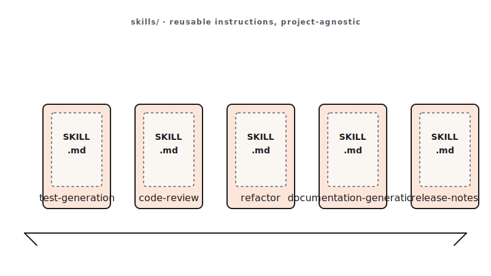

<!-- duration: 22 min -->
<!-- _class: tpl-cover -->
<!-- _paginate: false -->
<!-- _header: "" -->

<span class="module-chip">Module 09 · 22 min</span>

# Skills, Hooks, MCP & Multi-Agent Workflows

Claude Code Bootcamp · Day 1 · Block 9 of 10


---

<!-- _class: tpl-objectives -->

## Promise

In 22 minutes you will:

1. Author **your own** `SKILL.md` following the contract — the reusable workflow you keep.
2. Add a **hook** that runs format + lint before Claude can commit.
3. Recognise where an **MCP connector** would replace a paste-the-context prompt.
4. Decide when to fan out to **multi-agent / worktree** workflows — and when not to.

---

## Why this matters

- A skill is the unit of *carry-over*. It is the prompt that survives leaving this workshop.
- Hooks turn safety from "I hope I remembered" into "the tooling enforced it."
- MCP lets Claude **fetch** the ticket, the doc, the schema — instead of you pasting it.
- Multi-agent splits a feature across frontend / backend / tests and reassembles it. Powerful when scoped; chaotic when not.

---

## Concepts — four pillars of agentic engineering

- **Skills** — packaged, reusable workflows at `skills/<name>/SKILL.md`. Invoke with `/<name>`.
- **Hooks** — shell commands that fire before/after Claude actions (format, lint, deny dangerous commands, log).
- **MCP** — Model Context Protocol connectors. Claude reads Jira, Slack, Drive, GitHub, internal tools as first-class context.
- **Multi-agent** — a lead agent coordinates sub-agents in parallel worktrees; merge results back to one branch.



---

<!-- _class: tpl-show -->

## Live demo flow

1. Instructor opens `skills/code-review/SKILL.md`. Reads each H2 header aloud.
2. Picks a real task from earlier today — e.g., the BoN scoring loop.
3. Drafts a new skill `score-candidates` in 4 minutes following the same shape.
4. Invokes it: *"Use the `score-candidates` skill to evaluate these three diffs."*
5. Class watches Claude produce structured output that matches the skill's "Outputs" section.

---

<!-- _class: tpl-show -->

## Pillar 2 — Hooks: safety as tooling

Hooks fire **before or after** Claude actions. Use them to make good behaviour automatic.

- `post-edit` → run formatter (Prettier, Black, `cargo fmt`).
- `pre-commit` → run lint + tests; block commit on failure.
- `pre-bash` → deny `rm -rf`, `git push --force`, `--no-verify`.
- `post-action` → append to an agent action log for audit.

```jsonc
// .claude/hooks.json
{ "pre-bash": "scripts/deny-dangerous.sh",
  "post-edit":  "npx prettier --write $CLAUDE_FILES",
  "pre-commit": "npm test && npm run lint" }
```

---

<!-- _class: tpl-show -->

## Pillar 3 — MCP: connect Claude to real work

**Model Context Protocol** = open standard for plugging Claude into external data.

- **Issue trackers** (Jira, Linear, GitHub Issues) — Claude reads the ticket, asks clarifying questions, implements.
- **Docs** (Drive, Notion, Confluence) — Claude grounds answers in your actual spec, not a guess.
- **Chat** (Slack) — summarise threads, draft replies, file incidents.
- **Internal tools** — expose your own service over MCP; Claude treats it as a tool.

**Prompting changes**: stop pasting context. Say *"read MCP:jira/PROJ-123 and implement."* Set hard boundaries on what each connector may read/write.

---

<!-- _class: tpl-show -->

## Pillar 4 — Multi-agent & background workflows

One lead agent splits a feature across worker agents in **separate worktrees**:

- Worker A — backend API + migrations.
- Worker B — frontend component + state.
- Worker C — tests + fixtures.
- Lead — reviews each worktree, resolves conflicts, opens a single PR.

**Background sessions** let multiple full Claude Code sessions run in parallel.

**When NOT to fan out:** tasks under ≈30 minutes, shared mutable state, when sub-tasks aren't independent. The merge overhead eats the gain.

---

<!-- _class: tpl-show -->

## Mini project

Author one new skill of your own. Pick a workflow you actually want to repeat:

- `commit-and-pr` — generate Conventional Commits + PR text from a diff
- `screenshot-diff` — compare a render to a wireframe and patch the gap
- `regression-postmortem` — write a one-page postmortem from a failing test
- *(Any other repeatable workflow you noticed today.)*

---

<!-- _class: tpl-try -->

## Step-by-step lab

1. Open `skills/code-review/SKILL.md` in one pane and `specs/001-bootcamp-course-materials/contracts/skill.contract.md` in another.
2. Pick a name (kebab-case). Create `module-09/skill/SKILL.md`.
3. Fill the frontmatter, then each H2 section in order.
4. Self-check: does the file mention any path or filename specific to this workshop? If yes, generalise it.
5. Invoke your skill on a real input from earlier today (a diff, a render, a candidate set).
6. If the output matches your "Outputs" section: ship it. If not: tighten "Body" and re-run.

---

<!-- _class: tpl-show -->

## Suggested Claude Code prompts

```text
DRAFT THE SKILL
I want a Claude Skill called `<your-name>` that <one-sentence purpose>.
Following the contract at specs/001-bootcamp-course-materials/contracts/skill.contract.md,
draft the SKILL.md. Body must be project-agnostic — no references to specific
filenames or framework versions. Worked example must be runnable as-is.
```

```text
INVOKE THE SKILL
Use the `<your-name>` skill at module-09/skill/SKILL.md.
Inputs: <attach or paste the input>.
Produce the output exactly as the skill's "Outputs" section specifies.
```

---

<!-- _class: tpl-done -->

## Deliverable checklist

- [ ] `module-09/skill/SKILL.md` exists with valid frontmatter (`name`, `description`).
- [ ] All 6 body H2 sections present in order.
- [ ] No project-specific paths, filenames, or version numbers in the body.
- [ ] One real invocation captured in `module-09/invocation.md` (the prompt + the output).

---

<!-- _class: tpl-done -->

## Definition of done

✅ Skill validates against the contract · ✅ Project-agnostic · ✅ Real invocation produced output that matches the "Outputs" section.

---

<!-- _class: tpl-try -->

## Review checkpoint

Pair (60 s each):

1. Read partner's skill. Could you drop it into a *different* repo and have it work?
2. Identify one sentence in "Body" that is too vague to act on.

---

## Common mistakes

- Skill body that says "do a good job" — meaningless. Be operational.
- Embedding repo-specific paths or framework versions. The skill won't carry over.
- Skipping "Worked example". Reviewers can't tell whether the skill works without it.
- Hooks that swallow exit codes — a `pre-commit` that returns 0 on lint failure is worse than no hook.
- MCP connectors with **write** scope when **read** would do. Least privilege.
- Fanning out to 4 sub-agents on a 10-minute task — merge tax > productivity.

---

## Instructor notes

- 5 / 5 / 10 / 2 split.
- Open `skills/code-review/SKILL.md` live; many students will copy its shape verbatim, which is fine.
- Reinforce FR-018: project-agnostic. The validator will reject skills that fail the carry-over test.
- If short, drop the second invocation; one is enough.

---

<!-- _class: tpl-next -->

## Transition to next module

We have skills, code, tests, branches, docs. The last 18 minutes ask the hardest question: would you put any of this in production tomorrow?
**Next: Module 10 — Production Readiness.**

<!-- polish-log
(intermediate-content-polish feature 004) — populated during US2 polish pass.
-->
