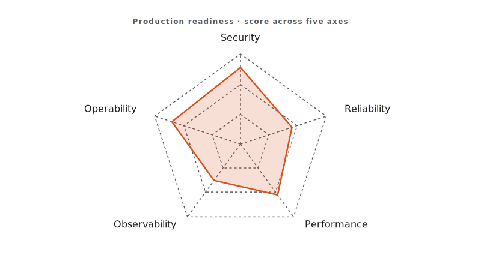

<!-- duration: 18 min -->
<!-- _class: tpl-cover -->
<!-- _paginate: false -->
<!-- _header: "" -->

<span class="module-chip">Module 10 · 18 min</span>

# Production Readiness

Claude Code Bootcamp · Day 1 · Block 10 of 10


---

<!-- _class: tpl-objectives -->

## Promise

In 18 minutes you will:

1. Pick one project from today and run it through a 5-axis production readiness check.
2. Write a one-page **Production Readiness Report** with go / no-go.
3. Identify the smallest next step you would take Monday morning.

---

## Why this matters

- "Works on my laptop" is not the bar. Production has 5 axes that always matter.
- Naming the gaps explicitly is what turns workshop output into something a real team can adopt.
- Hiring managers and tech leads grade engineers on how they think about this list.

---

## Concepts

- **Five axes**: Security · Observability · Deployment · Runbooks · Rollback.
- For each axis: one question you must answer, one risk you accept, one next step.
- Go / no-go is a decision, not a vibe. State it.
- Use `skills/production-readiness-review/SKILL.md` as the durable instrument.



---

<!-- _class: tpl-show -->

## Overeager agents — the May 2026 lesson

Research this year (arXiv 2605.18583) showed coding agents routinely take **out-of-scope actions on benign tasks**: editing files they weren't asked to, running shell commands the user never approved, expanding scope silently.

**Your defences, in order:**

- **Least-privilege tools** — only grant what this task needs.
- **Permission modes** — `ask` for shell, `deny` for network, `read-only` for `do-not-touch/` zones.
- **Shell approval** — every command requires a tap until trust is earned.
- **Review before commit** — diff-first, always; never `--no-verify`.
- **Disaster recovery** — clean branch, atomic commits, easy `git reset --hard`.

Treat the agent like a junior with `sudo`. Polite, fast, occasionally dangerous.

---

<!-- _class: tpl-show -->

## Live demo flow

1. Instructor picks the module-4 Notes API.
2. Invokes the production-readiness skill against the repo.
3. Walks the class through the 5-axis output.
4. Marks two axes red, three yellow, none green.
5. States the go / no-go: **no-go**, with the smallest next step that would flip the verdict.

---

<!-- _class: tpl-show -->

## Mini project

**Production Readiness Report** for one of your modules.

Deliverable: `module-10/production-readiness-report.md` — one page, structured by axis.

---

<!-- _class: tpl-try -->

## Step-by-step lab

1. Pick the module you'd actually want to ship: most likely module 4 (Notes API).
2. Open `skills/production-readiness-review/SKILL.md`.
3. Run the prompt below against your chosen module.
4. Read the output critically. Override anything Claude is wrong about — *you* are the engineer of record.
5. Fill the template below. Add a final go / no-go line.
6. Save to `module-10/production-readiness-report.md`.

---

<!-- _class: tpl-show -->

## Suggested Claude Code prompts

```text
PRODUCTION READINESS
Use the production-readiness-review skill against the project at <path>.

For each of the 5 axes (Security, Observability, Deployment, Runbooks, Rollback):
- One sentence answering: would this hold up in production this week?
- The single biggest risk.
- The single smallest next step that materially reduces the risk.

End with a one-line go / no-go verdict and the rationale (≤ 25 words).
```

---

## Report template

```markdown
# Production Readiness Report — <project>

## Security
- Status (green/yellow/red):
- Biggest risk:
- Smallest next step:

## Observability
- Status:
- Biggest risk:
- Smallest next step:

## Deployment
- Status:
- Biggest risk:
- Smallest next step:

## Runbooks
- Status:
- Biggest risk:
- Smallest next step:

## Rollback
- Status:
- Biggest risk:
- Smallest next step:

## Verdict
Go / No-Go: <choice>. Rationale: <≤25 words>.
```

---

<!-- _class: tpl-done -->

## Deliverable checklist

- [ ] `module-10/production-readiness-report.md` covers all 5 axes.
- [ ] Each axis has a status, a risk, and a next step.
- [ ] Verdict line is present and decisive.
- [ ] Rationale ≤ 25 words.

---

<!-- _class: tpl-done -->

## Definition of done

✅ One project assessed across 5 axes · ✅ Honest go / no-go verdict · ✅ One concrete step you could take Monday.

---

<!-- _class: tpl-try -->

## Review checkpoint

Pair (60 s each):

1. Read partner's verdict line. Believe it?
2. For one "yellow" axis, ask: what would actually flip it green?

---

## Common mistakes

- "All green, ready to ship". Almost never true after one workshop. Be honest.
- Vague next steps ("improve security"). Make them small and concrete.
- 4-page reports. One page or it doesn't get read.
- Skipping the verdict. The point of the exercise is the decision.

---

## Instructor notes

- 4 / 4 / 8 / 2 split.
- Demo the skill live against your own module-4 reference solution.
- If short, drop the verdict-rationale word limit but keep the verdict.
- Brief students on the assessment immediately after (quiz + practical + reflection).

---

<!-- _class: tpl-next is-finale -->

## Transition to next module

There is no next module — this is the wrap. Submit your zip per the **Submission workflow** in `student-guide.md`. Take the assessment. Earn the certificate. Go ship.
**Workshop complete. Welcome to AI-paired engineering.**

<!-- polish-log
(intermediate-content-polish feature 004) — populated during US2 polish pass.
-->
